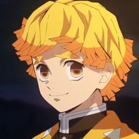
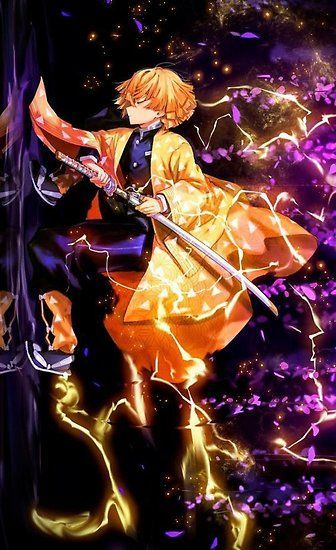
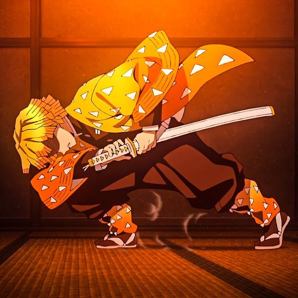
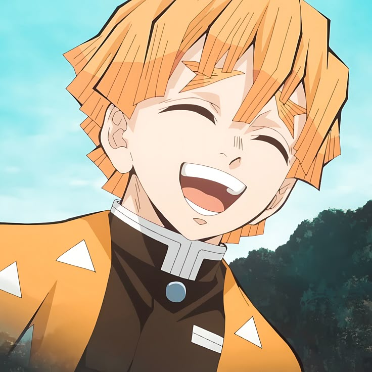

<!DOCTYPE html>
<html lang="vi">
<head>
  <meta charset="UTF-8">
  <title>Ojou-sama World</title>
  <meta name="viewport" content="width=device-width, initial-scale=1.0">

  
</head>

<body>

<header>
  <h1>Zenitsu core</h1>
  
“	Mình đang mơ, <em>một giấc mơ hạnh phúc</em>. Mình mạnh mẽ hơn bất kỳ ai trên đời này. Mình có thể cứu giúp những người yếu thế và chứng minh rằng khoảng thời gian mà Ông huấn luyện mình không phải là vô ích.
    Một giấc mơ, nơi mà mình trở nên hữu dụng, với mọi người !!!
    
    ”

</header>

<nav>
  <a href="#about">Giới thiệu</a>
  <a href="#skills">Kỹ năng</a>
  <a href="#gallery">Gallery</a>
  <a href="#timeline">Hành trình</a>

  <a href="#feedback">Khảo sát</a>
</nav>

<section id="about">
  <h2 class="section-title">Giới thiệu</h2>
  

    Agatsuma Zenitsu「我妻 善逸 Agatsuma Zen'itsu」là một kiếm sĩ diệt quỷ thuộc Sát Quỷ Đội. Cậu là bạn đồng hành của Kamado Tanjirou đồng thời cũng là một trong những nhân vật chính của Kimetsu no Yaiba.
  

  <h4>Thông tin cá nhân</h4>
  <table>
    <tr>
        <th>Chủng loài</th>
        <th>Sinh nhật</th>
        <th>Giới tính</th>
        <th>Tuổi</th>
        <th>Chiều cao</th>
        <th>Màu tóc</th>
        <th>Màu mắt</th>
        <th>Gia đình</th>
        <Th>Nghề nghiệp</Th>
        <Th>Tình trạng</Th>
    </tr>
    <tr>
        <td>Người</td>
        <td>3/9</td>
        <td>Nam</td>
        <td>16</td>
        <td>164,5cm</td>
        <td>
Vàng

          
Đen (trước đây)

        </td>
        <td>Vàng kim</td>
        <td>
Kuwajima Jogorou (Sư phụ, Đã chết)

          
Kaigaku (Sư huynh, Đã chết)
</td>
          <td>Kiếm sĩ diệt quỷ của sát quỷ đội</td>
          <td>Còn sống</td>
    </tr>
    
</table>

<h4>Ngoại hình</h4>

Zenitsu là một thiếu niên có mái tóc ngắn màu vàng, với đôi mắt vàng kim cùng cặp chân mày rậm. Cậu mặt bộ đồng phục diệt quỷ tiêu chuẩn màu đen với bộ haori màu vàng có hoa văn nhiều hình tam giác nhỏ màu trắng.

<h4>Tính cách</h4>

Zenitsu là một người <u>nhút nhát</u>, cậu liên tục tuyên bố rằng mình không còn sống được bao lâu do công việc quá nguy hiểm là trở thành kiếm sĩ diệt quỷ. Zenitsu cũng rất <u>mê gái</u> và luôn sa vào những cô gái mà cậu cho là dễ thương, yêu cầu họ kết hôn với cậu ta nhiều đến mức khiến người khác khó chịu.

Zenitsu rất tôn trọng và ngưỡng mộ đồng đội, đặc biệt là với người thầy quá cố của mình, Shihan. Khi Zenitsu trở nên <u>nghiêm túc và tập trung</u>, cậu hầu như dẹp bỏ phần nhút nhát của con người mình và chiến đấu với một nhân cách hoàn toàn khác.

</section>

<section id="skills">
  <h2 class="section-title">Kỹ năng</h2>
  

    

      <h3>Khả năng tự nhiên</h3>
      Thính giác nhạy bén, Chiến đấu vô thức, Tốc độ cực cao.
    

    

      <h3>Kiếm Thuật</h3>
      Lục Liên, Bát Liên, Thần Tốc, Hỏa Lôi Thần.
    

    
  

  <ol class="skill-list">
    <li>
<h4>Khả năng tự nhiên:</h4></li>
    <ul>
      <li>
<u>Thính giác nhạy bén</u>: Zenitsu có một thính giác nhạy bén, cho cậu khả năng <strong>phát hiện nguy hiểm</strong> từ âm thanh, kể cả những âm thanh nhỏ nhất. Thính giác của Zenitsu tốt đến độ cậu vẫn có thể nghe được người khác <strong>khi đang ngủ</strong>, cậu có thể nghe âm thanh từ <strong>mạch máu, nhịp tim</strong> và dễ dàng phân biệt được thứ âm thanh của người lẫn quỷ. Cậu cũng có thể nghe được <strong>tiếng lòng, cảm xúc</strong> của người khác nhờ thính giác của mình.
</li>
      <li>
<u>Chiến đấu vô thức</u>: Zenitsu có thể chiến đấu ngay cả <strong>khi đang ngủ</strong>. Mỗi khi gặp nguy hiểm, nỗi sợ hãi của cậu vượt quá giới hạn của bản thân khiến cậu bất tỉnh. Trong lúc ngủ, Zenitsu có thể sử dụng kiếm thuật của mình hoàn toàn chỉ dựa vào bản năng. Tuy nhiên, khi dần trải qua nhiều khó khăn và nguy hiểm, Zenitsu ngày càng cải thiện cả kỹ năng và lòng can đảm theo thời gian, vì vậy cậu ngày càng ít phụ thuộc vào khả năng này.
</li>
      <li>
<u>Tốc độ cực cao</u>: Zenitsu là một trong những kiếm sĩ <strong>nhanh nhất</strong> của Sát Quỷ Đội, cậu sở hữu một tốc độ di chuyển cực cao và phản xạ cực linh hoạt. Như khi cậu rút kiếm cắt đứt lưỡi một con quỷ cực kì nhanh gọn và chính xác. Đặc biệt khi đang dùng <strong>Hỏa Lôi Thần</strong>, tốc độ của cậu được mô tả là hoàn toàn nằm ngoài sự nhận thức.
</li>
  </ul>

    <li><h4>Kiếm Thuật:</h4></li>
    <ul>
    <li>
<u>Phích Lịch Nhất Thiểm・Lục Liên</u>: Zenitsu tung ra Phích Lịch Nhất Thiểm <strong>sáu lần liên tiếp</strong>, giúp gia tăng thêm rất nhiều tốc độ và tiếp cận kẻ địch một cách nhanh chóng, đòn này thậm chí làm <strong>rung chuyển cả không gian</strong> và tạo ra <strong>tiếng sét đánh</strong> cực lớn.
</li>
    <li>
<u>Phích Lịch Nhất Thiểm・Bát Liên</u>: <strong>Nâng cấp</strong> từ Lục Liên, Zenitsu tung ra Phích Lịch Nhất thiểm <strong>tám lần liên tiếp</strong>.
</li>
    <li>
<u>Phích Lịch Nhất Thiểm・Thần Tốc</u>: Zenitsu có thể sử dụng kỹ thuật này để <strong>gia tăng thêm tốc độ</strong> cho Phích Lịch Nhất Thiểm. Khiến cậu di chuyển với một tốc độ cực kì nhanh đồng thời <strong>gia tăng lực chém</strong> của bản thân lên đáng kể.
</li>
    <li>
<u>Hỏa Lôi Thần</u>: Là thức kiếm do Zenitsu <strong>sáng tạo</strong> ra. Khi sử dụng cơ thể cậu trở nên <strong>phát sáng</strong> với hào quang của một con rồng lửa và sấm sét, cho cậu khả năng di chuyển với một <strong>tốc độ cực kì khủng khiếp</strong>, có thể lao đến chém bay đầu tân Thượng Huyền Lục Kaigaku trước khi hắn nhận thức được điều gì đang xảy ra. Zenitsu thừa nhận rằng cậu tự sáng tạo ra thức kiếm này với mục đích muốn chiến đấu bên cạnh Kaigaku.
</li>
  </ul>
</ol>
</section>

<section id="gallery">
  <h2 class="section-title">Gallery</h2>
  <audio src="bandicam-2025-12-30-13-30-39-162.mp3" controls></audio>
    
Đoạn âm thanh gắn liền với các phân cảnh chiến đấu của nhân vật Zenitsu Agatsuma trong Kimetsu no Yaiba.

  

    

      
    

    

      
    

    

      
    

      

</section>

<section id="timeline">
  <h2 class="section-title">Hành trình</h2>
  

    

      <h3>Giai đoạn 1</h3>
      
Khi Zenitsu còn là một đứa trẻ, cậu bị một người phụ nữ lừa gạt và buộc phải gánh một khoản nợ cực kì lớn. Trong lúc khủng hoảng, cậu đã gặp được Ông Kuwajima Jigorou (cựu Minh Trụ), người đã cứu giúp cậu khỏi quãng thời gian khó khăn.

    

    

      <h3>Giai đoạn 2</h3>
      
Ông quyết định sẽ huấn luyện Zenitsu thành kiếm sĩ diệt quỷ cùng với đại đệ tử của mình, Kaigaku. Trong một ngày luyện tập mệt nhử, Zenitsu đã trốn trên một cái cây vì cảm thấy mình đã làm Ông thất vọng, đột nhiên một tia sét đánh trúng cậu, khiến tóc và lông mày của cậu chuyển thành màu vàng.

    

    

      <h3>Giai đoạn 3</h3>
      
Zenitsu và Kaigaku rất ghét nhau, tuy nhiên Zenitsu vẫn tôn trọng Kaigaku với tư cách như một huynh đệ đồng môn. Với mong muốn chiến đấu bên cạnh Kaigaku, cậu đã tự sáng tạo ra một thức mới của Hơi Thở của Sấm Sét, có tên "Hỏa Lôi Thần". 

    

  

</section>
<section id="feedback">
  <h2 class="section-title">Khảo sát</h2>
  

    Phần biểu mẫu dưới đây nhằm ghi nhận cảm nhận của người xem sau khi
    tìm hiểu về nhân vật Zenitsu Agatsuma và trải nghiệm các nội dung minh họa.
  

  <form id="feedbackForm" onsubmit="submitForm(event)">
    <!-- Trắc nghiệm -->
    <fieldset>
      

      
1. Bạn ấn tượng với đặc điểm nào của Zenitsu?

      <label>
        <input type="checkbox" name="impress" value="tinh-cach">
        Tính cách nhút nhát nhưng bộc phát mạnh mẽ
      </label> 
      <label>
        <input type="checkbox" name="impress" value="suc-manh">
        Sức mạnh khi rơi vào trạng thái ngủ
      </label> 
      <label>
        <input type="checkbox" name="impress" value="cam-xuc">
        Ngoại hình đặc biệt
      </label> 
      <label>
        <input type="checkbox" name="impress" value="khac">
        Yếu tố khác
      </label>

      
2. Mức độ yêu thích của bạn đối với nhân vật Zenitsu là:

      

      <label>
        <input type="radio" name="feeling" value="cam-dong">
        Chân ái
      </label> 
      <label>
        <input type="radio" name="feeling" value="bat-ngo">
        Rất mê
      </label> 
      <label>
        <input type="radio" name="feeling" value="giai-tri">
        Khá thích
      </label> 
      <label>
        <input type="radio" name="feeling" value="binh-thuong">
        Bình thường
      </label> 
      <label>
        <input type="radio" name="feeling" value="binh-thuong">
        Không hợp gu
      </label>

      

      
3. Theo bạn, mức đánh giá phù hợp nhất cho chất lượng tổng thể của trang web này là:
      <select name="voice">
        <option value="">-- Chọn một đáp án --</option>
        <option value="rat-phu-hop">10 điểm</option>
        <option value="phu-hop">Điểm tối đa</option>
        
      </select>
    

    <!-- Tự luận -->
    

      
      
4. Nếu mô tả Zenitsu bằng một từ, bạn sẽ chọn từ gì? 
      <textarea name="one-word" rows="3" placeholder="Nhập ý kiến của bạn..."></textarea>
    </fieldset>
    
    <button type="submit">Gửi phản hồi</button>
  </form>
  

    
    
Cảm ơn bạn đã phản hồi! ⚡

  

</section>
<section id="contact">
  <h2 class="section-title">Liên hệ</h2>
  
<a href="https://animevietsub.show/phim/thanh-guom-diet-quy-kimetsu-no-yaiba-i7-a3445/">Xem phim đi</a>

  
</section>

<footer>
  
© Agatsuma Zenitsu | Built by Ojou-sama

</footer>

</body>
</html>
